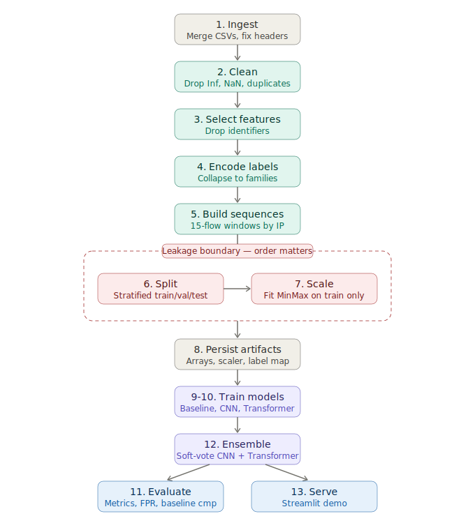
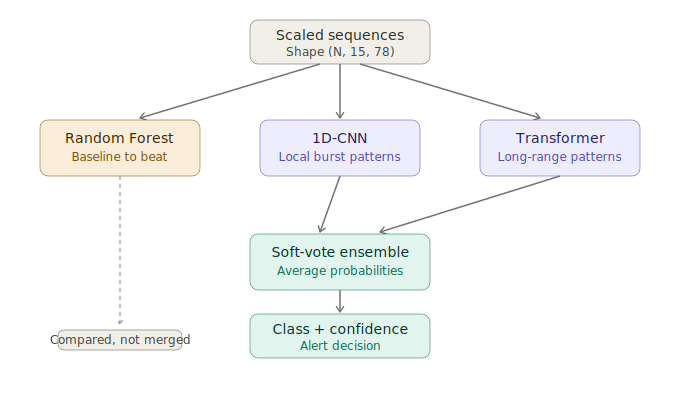

# 🛡️ Network Intrusion Detection

> Benchmarking classical and deep models for network attack detection on CIC-IDS2017
> CS 7357: Neural Networks and Deep Learning — Fall 2025
> Kennesaw State University


## 🎯 Project overview

Detecting network attacks from flow records on the CIC-IDS2017 dataset, with an
honest comparison of a classical baseline against two deep models.

Each network flow (76 features) is classified into one of nine traffic
categories — benign plus eight attack families (DDoS, DoS, probe, brute force,
botnet, infiltration, web attack, heartbleed). Three models compete: a Random
Forest baseline, a 1D-CNN, and a Transformer. The project is built so the
evidence decides which approach wins, rather than assuming the deep model is
best.



## 📊 Results

Evaluated on a held-out test set of 378,120 flows (15% of the data, stratified).

| Model                  | Accuracy | Macro Recall | Macro F1 | Weighted F1 | Attack FPR |
|------------------------|----------|--------------|----------|-------------|------------|
| **Random Forest**      | **0.9983** | 0.8957     | **0.9246** | **0.9983** | **0.0010** |
| CNN                    | 0.8614   | 0.9368       | 0.5744   | 0.9063      | 0.1599     |
| Transformer            | 0.0827   | 0.2845       | 0.1322   | 0.0785      | 1.0000     |
| Ensemble (CNN + Transformer) | 0.8570 | 0.9358 | 0.5929 | 0.9019      | 0.1650     |

**The finding: the Random Forest wins decisively.** It reaches 99.8% accuracy
with a 0.001 attack false-positive rate — meaning it almost never mislabels
benign traffic as an attack. The CNN catches attacks (high recall) but is noisy,
flagging ~16% of benign flows. The Transformer failed to learn on this tabular,
non-sequential data and is reported as a negative result, not hidden.

This is the honest takeaway from the experiment: **on CIC-IDS2017 flow features,
a classical tree ensemble outperforms deep models.** Tree ensembles are strong
on tabular data, and the deep architectures — which shine on images and
sequences — have no temporal or spatial structure to exploit here. The full
per-class breakdown, confusion matrix, and precision-recall curves are in
[`reports/`](reports/).

## 🧠 Why this project is built the way it is

Most intrusion-detection demos report 99% accuracy and stop there. That number
is misleading: the dataset is roughly 80% benign, so a model that flags nothing
still looks "80% accurate." This project is built around the questions a
security team actually asks.

**Are rare attacks being caught?** Evaluation reports per-class recall and
macro-averaged F1, not just overall accuracy, so a model can't hide poor attack
detection behind a pile of correct benign predictions. Class weights push the
models to learn rare attacks (Heartbleed has only 11 samples, Infiltration 36).

**How noisy are the alerts?** A dedicated attack false-positive-rate metric
measures how often benign traffic is wrongly flagged. Alert fatigue is the
number-one complaint about real intrusion detection systems, so it gets its own
column — and it's where the Random Forest pulls far ahead of the CNN.

**Is the deep model even worth it?** A Random Forest baseline is trained first,
and the deep models have to beat it. Here they didn't — and saying so plainly is
the point. A benchmark only means something if you're willing to report when the
simpler model wins.

**No data leakage.** Identifier columns (IP addresses, ports, timestamps) are
dropped before training so a model learns behavior, not which machine sent the
traffic. The scaler is fit on the training split only, then applied to
validation and test — fitting on everything leaks test statistics and inflates
every number.

## 🏗️ Approach



The task is **per-flow classification**: each flow is classified independently.
The CIC-IDS2017 machine-learning CSVs carry no source-IP or timestamp columns,
so flows can't be ordered in time or grouped by host — time-ordered sequences
aren't meaningful on this data, which is why per-flow (the standard approach for
these files) is used.

- **Random Forest** — 200 trees, balanced class weights. The baseline, and the
  winner.
- **1D-CNN** — convolutions over the feature vector to learn local feature
  interactions.
- **Transformer** — self-attention over features; included to test whether
  attention helps on tabular data (it didn't).

## 🚀 Quickstart

```bash
pip install -r requirements.txt

# 1. generate synthetic CIC-IDS2017-shaped data (or skip and use real CSVs)
python -m src.synthetic_data

# 2. preprocess: clean, select features, split, fit + save the scaler
python -m src.preprocess

# 3. train the baseline + CNN + Transformer
python -m src.train            # add --epochs 4 for a quick smoke test

# 4. evaluate everything on the held-out test set
python -m src.evaluate

# 5. launch the demo
streamlit run app/intrusion_dashboard.py
```

Tests: `pytest -q`

GPU note: the full dataset (~2.5M flows) trains comfortably on a free Kaggle or
Colab GPU in minutes. On CPU the Random Forest alone takes several minutes.

## 📊 Using the real dataset

Download CIC-IDS2017 (Canadian Institute for Cybersecurity) — the
`MachineLearningCSV` bundle — put the CSVs in `data/raw/`, delete the synthetic
file, and rerun from step 2. The preprocessing script prints the final feature
count; set `NUM_FEATURES` in `config.py` to match if it differs.

## 📁 Repository layout

```
config.py                  all paths, shapes, and hyperparameters
src/synthetic_data.py      generates CIC-IDS2017-shaped test data
src/preprocess.py          merge → clean → select features → encode → split → scale
src/models.py              per-flow 1D-CNN and Transformer definitions
src/train.py               baseline + class-weighted deep training
src/evaluate.py            metrics, confusion matrix, PR curves, comparison
app/intrusion_dashboard.py Streamlit inference demo
tests/test_pipeline.py     leakage, shape, and output-distribution tests
reports/                   generated metrics and figures
assets/                    README diagrams (pipeline.svg, ensemble.svg)
docs/PIPELINE_REFERENCE.md step-by-step map of pipeline to code (interview prep)
```

## ⚠️ Limitations

This is a research/portfolio project, not a production IDS. Worth knowing:

- **CIC-IDS2017 is from 2017.** Attack techniques and normal traffic have both
  moved on. A model trained here would need retraining and validation on current
  traffic before it meant anything operationally.
- **Flow features only.** It works on statistical flow summaries, not packet
  payloads, so it can't inspect encrypted-traffic contents.
- **Per-flow, not temporal.** Because these CSVs lack IP/timestamp context, the
  model judges each flow in isolation and can't catch slow multi-flow attack
  patterns that only emerge over time.
- **Concept drift is unhandled.** Real deployments need monitoring and periodic
  retraining as traffic patterns shift; none of that is here.

## 📄 License

MIT — see `LICENSE`.
